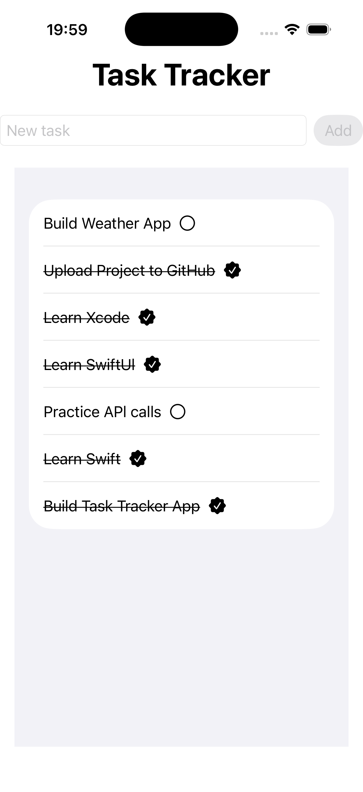

# 📝 Task Tracker App

A simple Task Tracker app built with SwiftUI and SwiftData.

## 🚀 Features
- Add new tasks
- Mark tasks as completed
- Delete tasks with swipe gesture
- Local data persistence
- Dynamic task list with `List` & `ForEach`

## 🛠 Technologies
- Swift 6
- SwiftUI
- SwiftData
- Xcode 26

## 📚 What I Practiced
- SwiftUI layouts (`VStack`, `HStack`, `List`)
- State management with `@State`
- User input with `TextField`
- Dynamic UI using `ForEach`
- Gesture handling with `onTapGesture`
- CRUD operations
- Local persistence with SwiftData
- Debugging common SwiftUI errors
- Testing with iOS Simulator
- Basic project structure

## 📸 Screenshot

